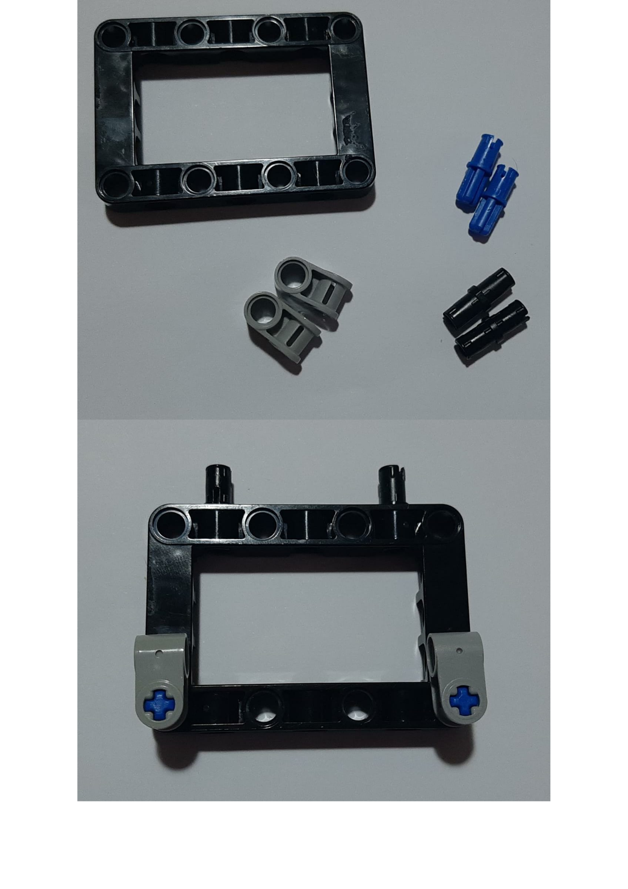

# 🤖 EV3 Robot Design & Essentials + Fundamentals + Challenges 

## Description

Welcome to the EV3 Robot Design Course! In this course, we will learn how to build and program robots using the LEGO Education EV3 set. 

## 🚀 Getting Started

To get started with the course, you will need the following:

> LEGO Education EV3 set
> LEGO Education EV3 software
> Computer with USB port

### 🛠 Building the Base Drive
> The first robot we will build is a base drive, which includes an ultrasonic sensor and a color sensor. Follow these instructions to build the robot:

### 💯 You will need

### 💯 try to understand these images to follow the instructions

🚩One

> Collect the items and attach the two motors

🚩Two

> Build this object to be a support for the robot

