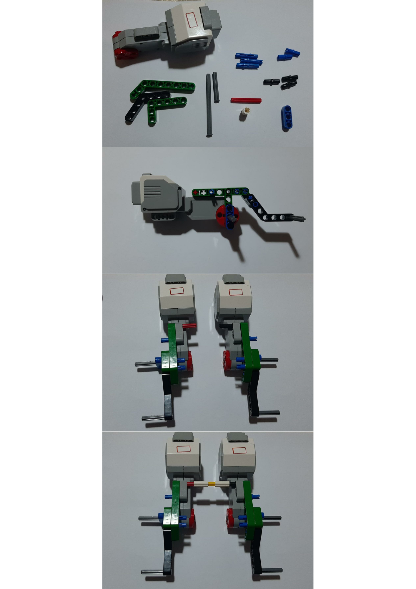
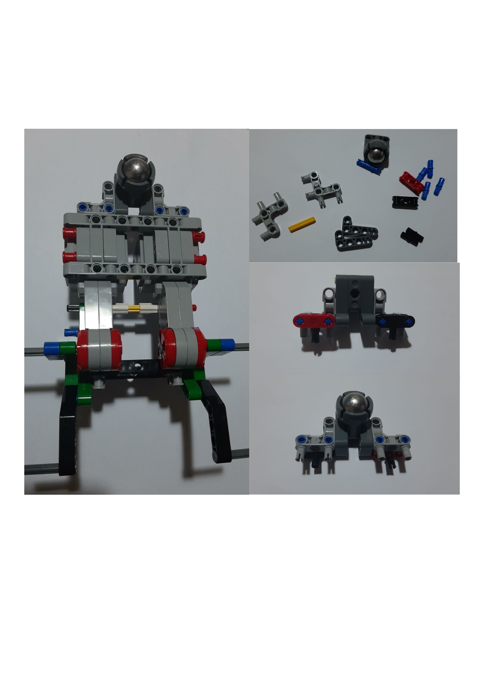
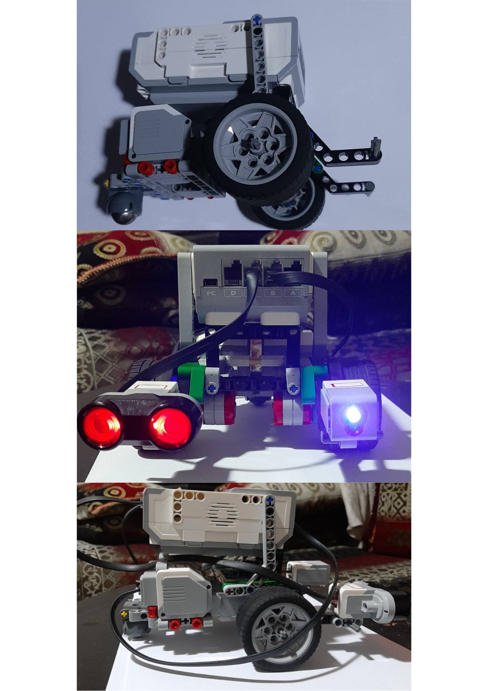

# 🤖 EV3 Robot Design & Essentials + Fundamentals + Challenges 

### Description

Welcome to the EV3 Robot Design Course! In this course, we will learn how to build and program robots using the LEGO Education EV3 set. 

### 🚀 Getting Started

To get started with the course, you will need the following:

> LEGO Education EV3 set
> LEGO Education EV3 software
> Computer with USB port

# 🛠 Building the Base Drive
> The first robot we will build is a base drive, which includes an ultrasonic sensor and a color sensor. Follow these instructions to build the robot:

### 💯 You will need

### 💯 try to understand these images to follow the instructions

🚩One

> Collect the items and attach the two motors

🚩Two

> Build this object to be a support for the robot

🚩Three

> Build this object to be a back support for the next object that we will work on!

🚩Four

> Build this object you will need it to make the movement super easy

🚩Five

> We added the Robot, mais object, and the sensors.. the motors are plugged in the Ports A B C D and sensors in the ports 1 2 3 4 
> We have 2 motors plugged in B and C and Ultrasonic sensor and Color sensor plugged in 1 and 4 .

