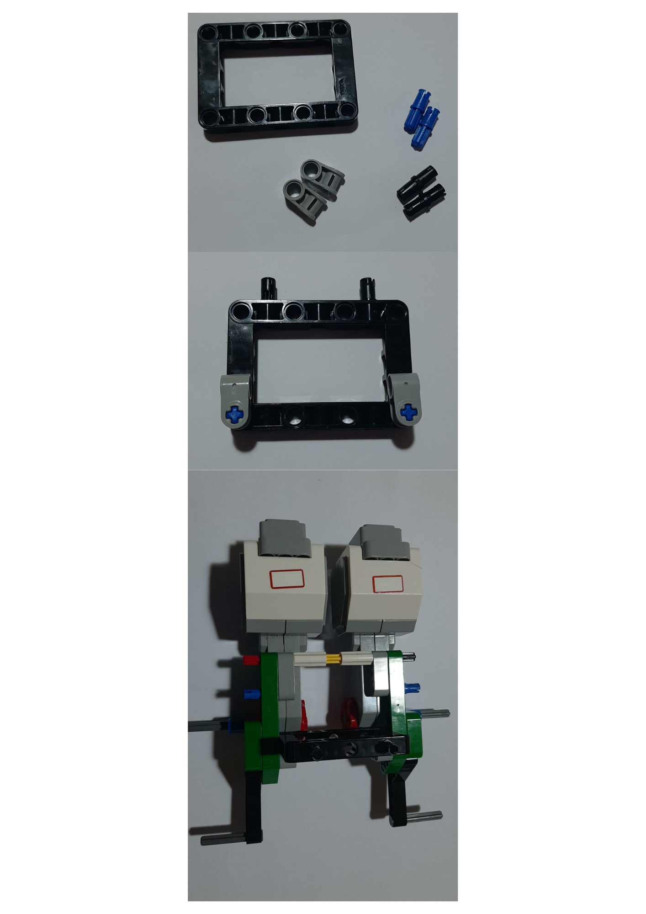
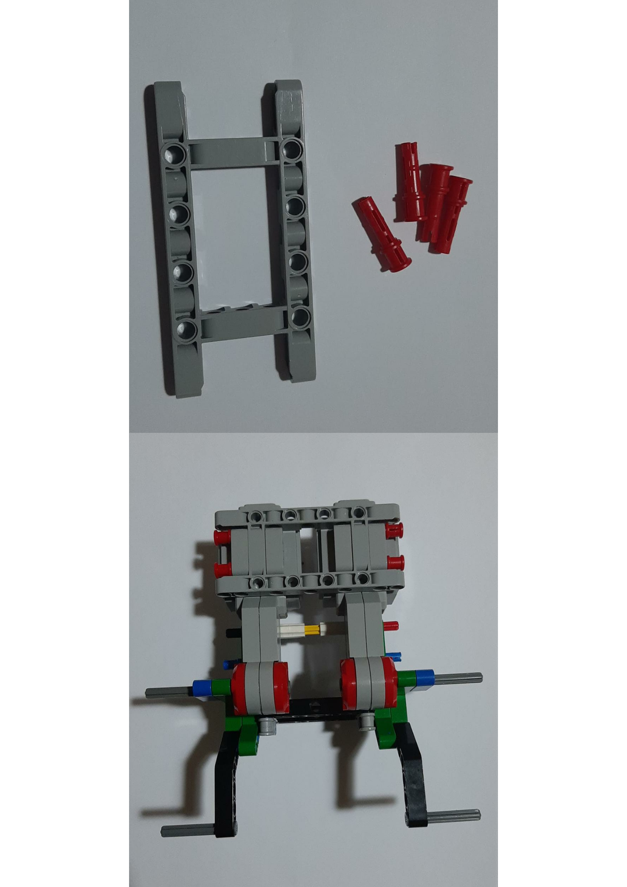
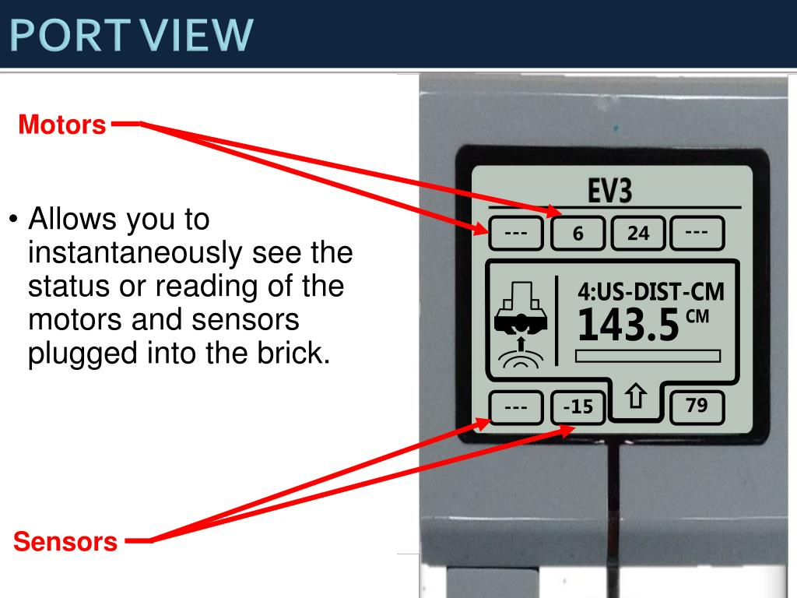

# 🤖 EV3 Robot Design & Essentials + Fundamentals + Challenges 

### Description

Welcome to the EV3 Robot Design Course! In this course, we will learn how to build and program robots using the LEGO Education EV3 set. 

### 🚀 Getting Started

To get started with the course, you will need the following:

> LEGO Education EV3 set
> LEGO Education EV3 software
> Computer with USB port

# 🛠 Building the Base Drive
> The first robot we will build is a base drive, which includes an ultrasonic sensor and a color sensor. Follow these instructions to build the robot:

### 💯 You will need

### 💯 try to understand these images to follow the instructions

🚩One

> Collect the items and attach the two motors

🚩Two

> Build this object to be a support for the robot

🚩Three

> Build this object to be a back support for the next object that we will work on!

🚩Four

> Build this object you will need it to make the movement super easy

🚩Five

> We added the Robot, mais object, and the sensors.. the motors are plugged in the Ports A B C D and sensors in the ports 1 2 3 4 
> We have 2 motors plugged in B and C and Ultrasonic sensor and Color sensor plugged in 1 and 4 .

# 🌟 Examples Of the most common Robot Design 

🤖 In our EV3 training course, we'll be working with some amazing robots! First up is DroidBot 2.0 🤖, a versatile robot with advanced sensing and movement capabilities. Next, we have Endeavor 🚀, a robot designed for exploration and discovery. We'll also be working with Driving Bas 3 🚗, a speedy robot with impressive maneuverability, and Enterprise 🏭, a robot designed for industrial automation. And let's not forget about Discovery 🔍, a robot equipped with sensors to detect and analyze its environment. Each of these robots has its own unique features and challenges

# 🚧 Ports, Sensors

🔌 When building and programming robots with the EV3 system, it's important to know which ports to use for different sensors and motors. The EV3 brick has four motor ports, labeled A, B, C, and D, and four sensor ports, labeled 1, 2, 3, and 4. 🤖 To build a basic robot, you'll need to plug in two large motors to the A and D ports to create a base drive, and you can use the other ports to add additional motors or sensors to your robot. 🚀 There are many different types of sensors available for the EV3, including ultrasonic sensors, color sensors, gyro sensors, touch sensors, and more. Each sensor has its own unique capabilities and can be used to detect and measure different aspects of the robot's environment. 🌟 By understanding the different ports and sensors, you'll be able to design and program robots with a wide range of capabilities and applications. 🔌🤖🚀🌟

# 🥽 Port View 

The Port View in the EV3 programming software is a graphical interface that allows you to monitor and control the sensors and motors connected to your robot's ports. 🤖 When you open the Port View, you'll see a grid with rows for each sensor port and columns for each motor port, and you can click on each cell to select the corresponding device. 🚀 Once you've selected a device, you can see information about its current state, such as its sensor reading or motor power level, and you can also send commands to the device, such as setting a motor to a specific speed or direction. 🌟 The Port View is a useful tool for debugging and testing your robot, as you can see real-time data from your sensors and motors and make adjustments as needed. It can also be used to create custom sensor and motor configurations, such as using a touch sensor to control the speed of a motor. 🌟 Overall, the Port View is a powerful feature of the EV3 programming software that can help you create more sophisticated and responsive robots. 🤖🚀🌟

## 🏆 Challenges are coming soon in this repository !

📍Source https://ev3lessons.com/en/

